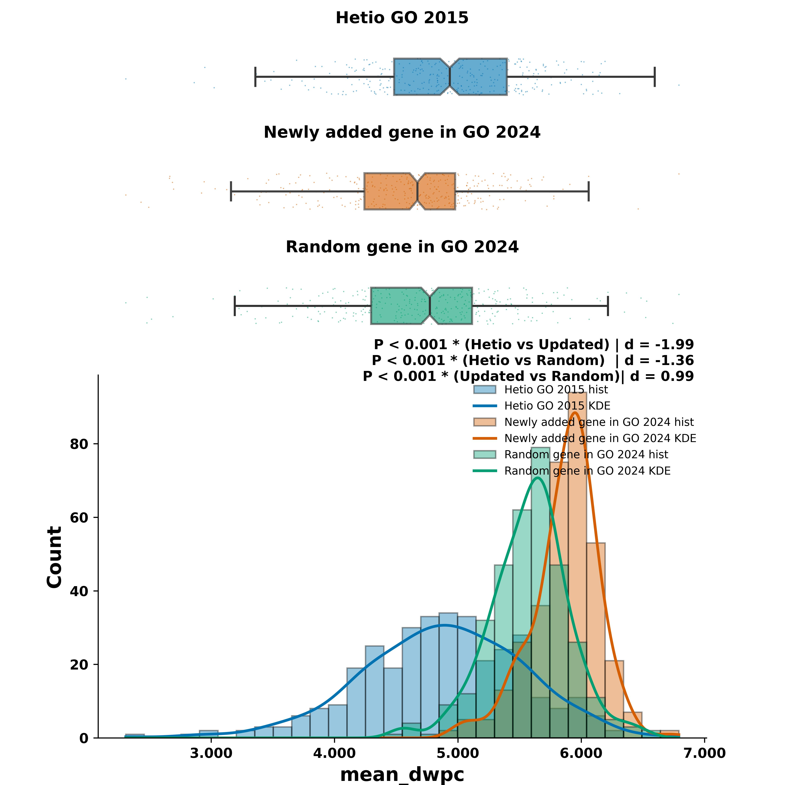
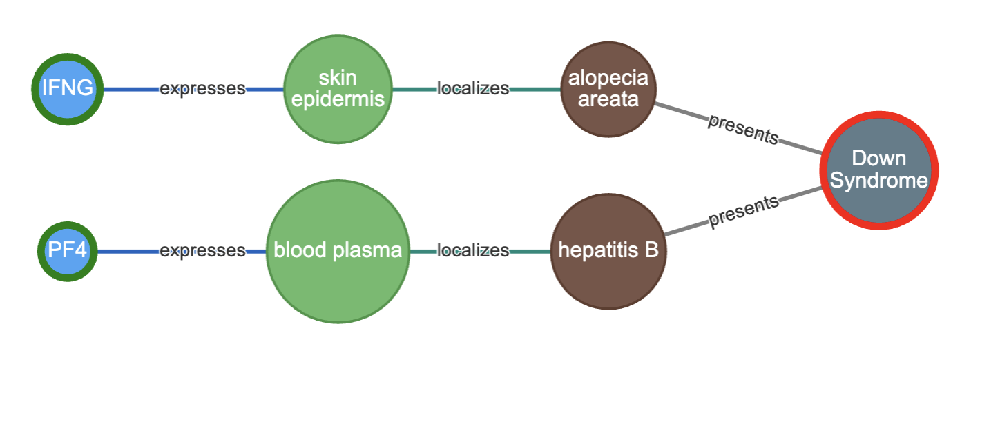
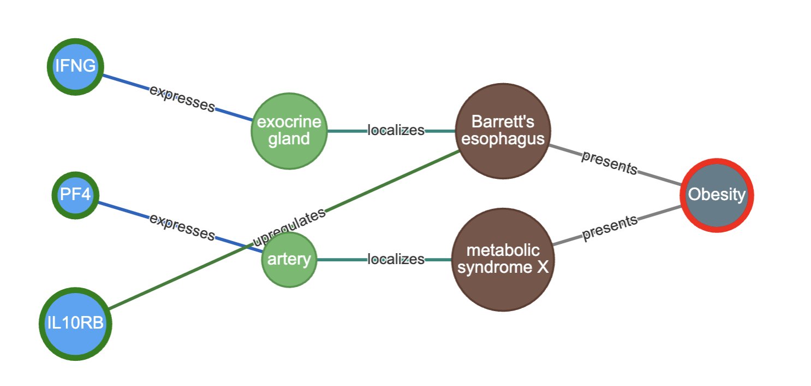
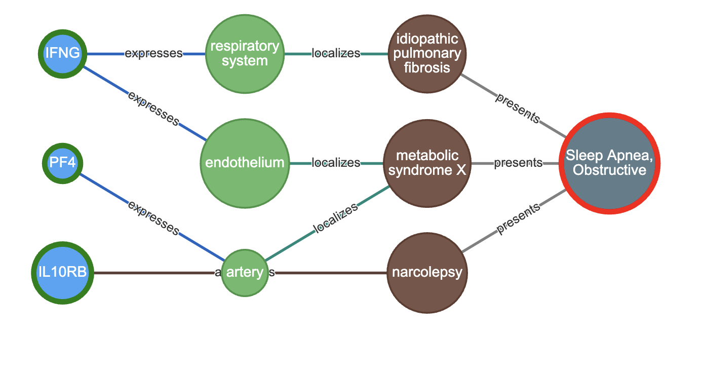

# Hetionet Analysis with Updated GO Terms (2024)

## Overview

The notebook (1_hetionet_analysis_w_updated_GO_final.ipynb) performs a comparative network-based analysis of gene annotations using updated 2024 Gene Ontology (GO) Biological Process (BP) terms, focusing on their impact within the Hetionet framework. By analyzing the connectivity patterns between GO terms and genes via metapaths and path statistics, this work evaluates how updated annotations influence biological relationship inference in Hetionet.

## Objectives

- **Compare** the original Hetionet GO annotations (circa 2015) with the latest GO BP annotations from 2024.
- **Filter GO terms** to include only those with ≤250 genes and ≤25% newly added genes in the updated version to focus on modest yet meaningful updates.
- **Integrate Hetionet metapath statistics** to assess changes in:
  - Degree-weighted path counts (DWPC)
  - Nonzero means and standard deviations
  - P-values and adjusted P-values
- **Generate matched control sets** ("pseudo-GO") by:
  - Sampling random genes while preserving gene set sizes
  - Preserving the distribution of gene additions to evaluate the specificity of observed effects

## Hypothesis

> *Updated GO annotations from 2024 that modestly expand gene coverage (≤25%) yield biologically meaningful changes in network connectivity, as captured by Hetionet’s metapath statistics. These effects are expected to differ significantly from random gene additions, indicating improved specificity and sensitivity of updated GO-based inferences.*

## Key Analyses

1. **Data Preparation**
   - Load updated GO BP terms (2024)
   - Filter to GO terms with 2–250 genes
   - Quantify added genes compared to original Hetionet annotations

2. **Hetionet Integration**
   - Import precomputed Hetionet metapath statistics (length-3)
   - Filter for valid GO-Gene pairs
   - Align GO terms between Hetionet (2015) and Updated GO (2024)

3. **Pseudo-GO Construction**
   - Construct pseudo-GO terms using random sampling
   - Match gene counts and added gene proportions

4. **Statistical Comparison**
   - Compare DWPC and other path metrics between:
     - Hetionet GO 2015
     - Updated GO 2024
     - Pseudo-GO (random control)

## Outputs

- Comparative distribution plots (strip plots, histograms)
- Statistical test results (e.g., t-tests) for DWPC and related metrics
- Venn diagrams of gene overlaps between GO versions
- Annotated summary tables of gene additions per GO term

Fig 1: Comparision of distributions of mean DWPC when GO added new genes

## Project Conclusion

This analysis demonstrates the utility of incorporating updated Gene Ontology (GO) annotations (2024) into Hetionet’s network-based framework for evaluating gene-function relationships.

### Key Findings

- **Updated GO terms introduced new gene associations** in ~25% of genes for many Biological Process (BP) terms while retaining compatibility with Hetionet’s existing GO-gene structure.
- **DWPC and other metapath-based statistics** (e.g., nonzero mean, p-values) exhibited **significant differences** between:
  - Original Hetionet GO terms (2015),
  - Updated GO terms (2024), and
  - Pseudo-random GO terms matched by size.
- These differences indicate that **updated GO annotations reflect meaningful biological additions**, improving the semantic and topological relevance of GO-gene connections.
- In contrast, **randomly assigned pseudo-GO sets** failed to replicate the statistical enrichment observed in the updated GO terms, supporting the **biological specificity** of the added gene annotations.

### Implications

- Modest updates in curated ontologies (≤25% gene additions) can still produce **significant shifts in network-based inference**, emphasizing the importance of using up-to-date annotations in knowledge graph analysis.
- The methodology of combining structured metapath statistics with **matched random control comparisons** offers a reproducible approach for testing annotation updates in heterogeneous networks like Hetionet.

# Multiple Connectivity Search with Hetionet API

## Overview

The notebook (2_multiple_connectivity_search_hetionetAPI.ipynb) implements a modular framework to retrieve and visualize multi-gene connectivity paths using the Hetionet API. It automates the process of querying metapaths and detailed paths from multiple source genes to a target node (e.g., disease), maps metadata for interpretation, and renders interactive visualizations using PyVis.

## Objectives

- Automate **batch querying** of Hetionet API for metapaths and paths between multiple gene nodes and a target node.
- Extract, **filter**, and **annotate** returned data for biological relevance.
- Visualize networks interactively using **PyVis** with customizable styling.

## Key Features

- Supports multiple source nodes (e.g., gene symbols or IDs).
- Automatically fetches both:
  - **Metapaths** (schemas of node transitions)
  - **Paths** (actual node sequences)
- Integrates metadata such as:
  - Node types and names
  - Relationship types
- Interactive network rendering:
  - Custom coloring for source and target nodes
  - Dynamic layout and physics simulation
  - Export to HTML for sharing

## Workflow

1. **Input**: List of source nodes (e.g., gene IDs) and a single target node (e.g., a disease)
2. **Query Metapaths**: API call to retrieve all valid metapath types
3. **Query Paths**: API call to retrieve all paths following each metapath
4. **Filter and Map**:
   - Annotate nodes and relationships
   - Filter redundant or irrelevant paths
5. **Visualization**: Generate PyVis network graph with source/target highlighting

Fig 2: Mutiple Connectivity Search in Hetionet inbetween multiple genes (Sources) and Down Syndrome as symptoms (target)

Fig 3: Mutiple Connectivity Search in Hetionet inbetween multiple genes (Sources) and Obesity (target)

Fig 4: Mutiple Connectivity Search in Hetionet inbetween multiple genes (Sources) and Sleep Apnea (target)

## Usage Notes

- Make sure you have access to the Hetionet API endpoint.
- Paths returned are dependent on Hetionet's schema version.
- Visualization can be exported as `.html` for local exploration.

## Development

1. [Install `uv`](https://docs.astral.sh/uv/getting-started/installation/).
1. Install package locally (e.g. `uv pip install -e ".[dev]"`).
1. Run tests (e.g. `uv run poe test`, through [poethepoet](https://poethepoet.natn.io/index.html) task).
1. Run various tasks (e.g. `uv run poe run_bioproc_gene_metapath_test`)

