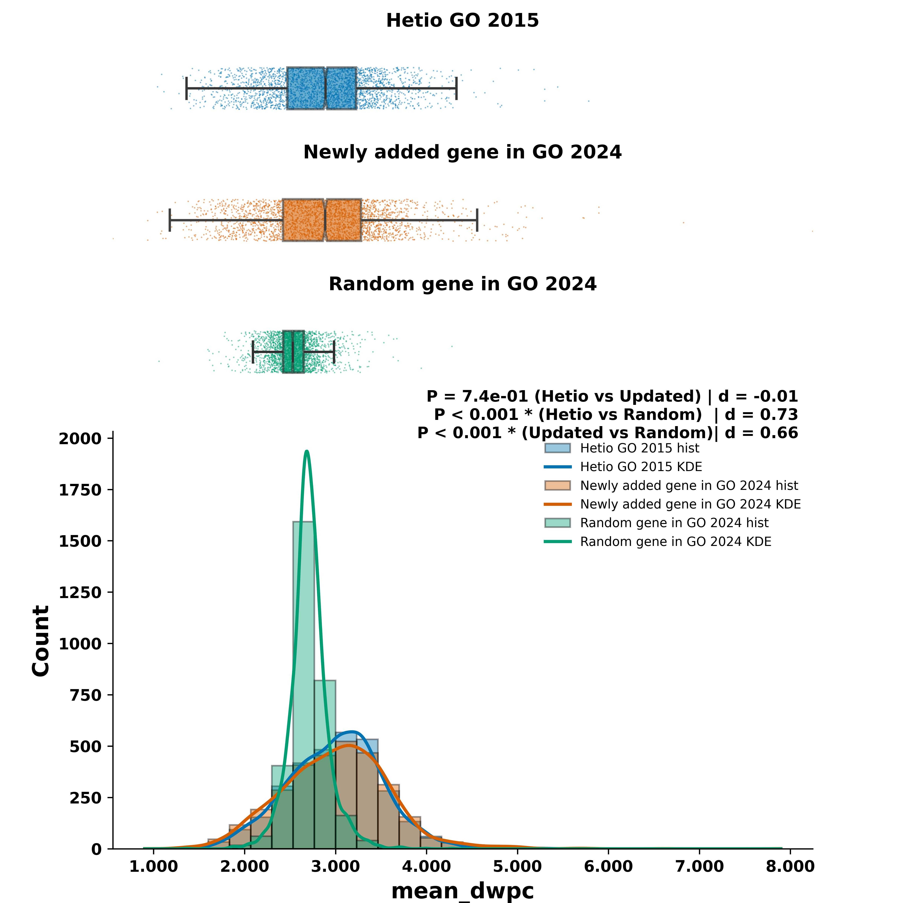

# Impact of Gene Ontology Updates on Network Properties of Hetinet: A Comparative Analysis of Hetionet 2015 and GO 2024
## Introduction

Gene Ontology (GO) provides a structured and continually updated vocabulary for annotating gene functions, biological processes, and cellular components. Integrating GO annotations into heterogeneous networks, such as Hetionet, enables systematic exploration of gene–biological process relationships and supports network-based analyses in systems biology. As GO is updated, it is important to assess how new annotations affect the structure and properties of such networks.

## Objective

The objective of this study is to systematically compare the network properties of gene–GO term associations from Hetionet GO 2015, the updated GO 2024, and randomly generated gene–GO pairs. We aim to evaluate how updates in GO annotations influence network statistics and to determine whether newly added associations in GO 2024 exhibit distinct or biologically meaningful patterns compared to existing and random associations.

## Hypotheses

**Hypothesis 1: GO Annotation Expansion**

- The GO-gene associations in GO 2024 do not differ from those in Hetionet GO 2015.

**Hypothesis 2: Metapath Statistics for Newly Added Genes**

- For GO terms with ≤250 genes and ≤25% newly added genes, the distributions of GO-gene metapath statistics (e.g., mean DWPC, mean p-value etc.) for newly added genes in GO 2024 are the same as those for Hetionet-associated genes.

**Hypothesis 3: Specificity of Curated vs. Random Associations**

- Randomly generated GO-gene pairs differ significantly in their network connectivity statistics compared to curated associations in Hetionet or GO 2024.

## Datasets

- **Hetio GO 2015:**  
  Gene–GO term associations as represented in the 2015 release of Hetionet.

- **Updated GO 2024:**  
  Gene–GO term associations from the 2024 update of the Gene Ontology, including both previously known and newly added associations.

- **Random GO-G pairs:**  
  Randomly generated gene–GO term pairs, matched in size to the curated datasets, used as a negative control to assess the specificity of observed network properties.

### Metapath Statistics and Parameters

Details of the metapath statistics and the connectivity search framework are described in the following publication:

**Hetnet connectivity search provides rapid insights into how biomedical entities are related**  
*Daniel S. Himmelstein, Michael Zietz, Vincent Rubinetti, Kyle Kloster, Benjamin J. Heil, Faisal Alquaddoomi, Dongbo Hu, David N. Nicholson, Yun Hao, Blair D. Sullivan, Michael W. Nagle, and Casey S. Greene*  
*GigaScience*, Volume 12, 2023, giad047  
[https://doi.org/10.1093/gigascience/giad047](https://doi.org/10.1093/gigascience/giad047)

The following metapath parameters are used to quantify connectivity between biomedical entities:

- **DWPC (Degree-Weighted Path Count)**: Penalizes high-degree nodes to emphasize specific paths.
- **P-value**: Empirical significance based on permutation tests.
- **Adjusted P-value**: FDR-corrected p-value to account for multiple testing.
- **Non-zero DWPC mean**: Mean DWPC across permutations where paths were non-zero.
- **Non-zero DWPC standard deviation (σ)**: Standard deviation across non-zero permutations, useful for z-score normalization.

These parameters help identify biologically meaningful connections with statistical rigor.

##Analysis Details

The full implementation and analysis details are available in the notebook [`1_hetionet_analysis_w_updated_GO_final.ipynb`](./1_hetionet_analysis_w_updated_GO_final.ipynb).

## Outputs

- Comparative distribution plots (strip plots, histograms)
- Statistical test results (e.g., t-tests) for DWPC and related metrics
- Venn diagrams of gene overlaps between GO versions
- Annotated summary tables of gene additions per GO term

  
*Fig 1: Mean DWPC across GO_2015, GO_2024, and pseudo-GO for matched terms.*

  
*Fig 2: Pairwise scatter plots comparing GO-gene association statistics across three datasets: Hetio GO 2015, Updated GO 2024, and Random GO-G pairs. Each row represents a different statistic, with the column name as the row title. The plot displays the Pearson correlation coefficient (ρ) and the corresponding p-value for each comparison.*

### Discussion

In this analysis, we compared the distributions and relationships of metapath-based statistics (such as mean DWPC, mean p-value, mean adjusted p-value, mean nonzero mean, and mean nonzero SD) across three groups: Hetio GO 2015, Updated GO 2024, and Random GO-G pairs. The scatter plots and statistical summaries provided several key insights:

- **Consistency and Change in GO Annotations:**  
  The comparison between Hetio GO 2015 and Updated GO 2024 revealed both stability and evolution in GO term–gene associations. While many associations are preserved, the updated dataset introduces new gene–GO pairs, reflecting the growth of biological knowledge.

- **Statistical Distributions:**  
  The distributions of metapath statistics for the updated GO 2024 group often differ from those of the original Hetio GO 2015 group, especially for GO terms with ≤250 genes and ≤25% gene increase. This suggests that newly added genes in the updated GO are not simply random additions but may have distinct network properties.

- **Random Controls:**  
  The Random GO-G pairs serve as a negative control. Their distributions and scatter plot correlations are generally distinct from both Hetio and Updated GO groups, supporting the biological relevance of the curated associations.

- **Correlations:**  
  The pairwise scatter plots show varying degrees of correlation between the groups. Typically, the correlation between Hetio and Updated GO is higher than between either of these and the random group, further supporting the validity of the updated annotations.

### Conclusion

Our results demonstrate that updates to GO annotations (from 2015 to 2024) introduce new gene–GO associations with distinct network properties, as measured by metapath statistics. These new associations are not random but are biologically meaningful, as evidenced by their statistical profiles and their differences from random gene–GO pairings. The methodology and visualizations used here provide a robust framework for assessing the impact of annotation updates in biological networks and can be extended to future releases or other ontologies.

Overall, this analysis highlights the importance of continuous curation and integration of updated biological knowledge into network resources, and the value of systematic, quantitative comparison to assess the impact of such

# Multiple Connectivity Search with Hetionet API

## Overview

The notebook (2_multiple_connectivity_search_hetionetAPI.ipynb) implements a modular framework to retrieve and visualize multi-gene connectivity paths using the Hetionet API. It automates the process of querying metapaths and detailed paths from multiple source genes to a target node (e.g., disease), maps metadata for interpretation, and renders interactive visualizations using PyVis.

## Objectives

- Automate **batch querying** of Hetionet API for metapaths and paths between multiple gene nodes and a target node.
- Extract, **filter**, and **annotate** returned data for biological relevance.
- Visualize networks interactively using **PyVis** with customizable styling.

## Key Features

- Supports multiple source nodes (e.g., gene symbols or IDs).
- Automatically fetches both:
  - **Metapaths** (schemas of node transitions)
  - **Paths** (actual node sequences)
- Integrates metadata such as:
  - Node types and names
  - Relationship types
- Interactive network rendering:
  - Custom coloring for source and target nodes
  - Dynamic layout and physics simulation
  - Export to HTML for sharing

## Workflow

1. **Input**: List of source nodes (e.g., gene IDs) and a single target node (e.g., a disease)
2. **Query Metapaths**: API call to retrieve all valid metapath types
3. **Query Paths**: API call to retrieve all paths following each metapath
4. **Filter and Map**:
   - Annotate nodes and relationships
   - Filter redundant or irrelevant paths
5. **Visualization**: Generate PyVis network graph with source/target highlighting

Fig 3: Mutiple Connectivity Search in Hetionet inbetween multiple genes (Sources) and Down Syndrome as symptoms (target)

Fig 4: Mutiple Connectivity Search in Hetionet inbetween multiple genes (Sources) and Obesity (target)

Fig 5: Mutiple Connectivity Search in Hetionet inbetween multiple genes (Sources) and Sleep Apnea (target)

## Usage Notes

- Make sure you have access to the Hetionet API endpoint.
- Paths returned are dependent on Hetionet's schema version.
- Visualization can be exported as `.html` for local exploration.

## Development

1. [Install `uv`](https://docs.astral.sh/uv/getting-started/installation/).
1. Install package locally (e.g. `uv pip install -e ".[dev]"`).
1. Run tests (e.g. `uv run poe test`, through [poethepoet](https://poethepoet.natn.io/index.html) task).
1. Run various tasks (e.g. `uv run poe run_bioproc_gene_metapath_test`)

